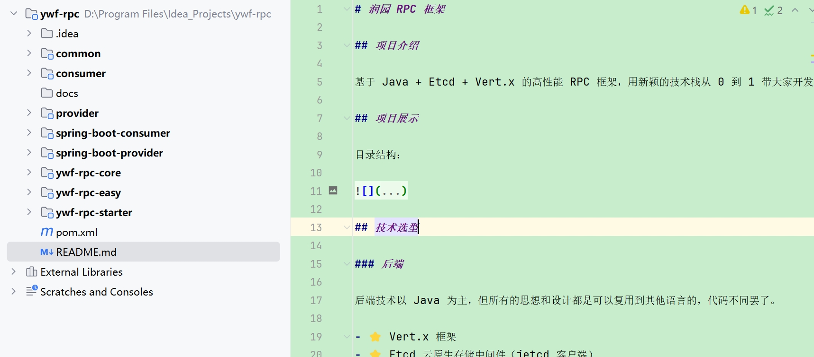
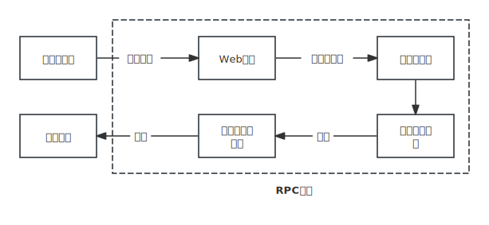

# 润园 RPC 框架

## 项目介绍

基于 Java + Etcd + Vert.x 的高性能 RPC 框架，基于Vert.x 的网络服务器、序列化器、基于 Etcd 和 ZooKeeper 的注册中心、反射、动态代理、自定义网络协议、多种设计模式（单例 / 工厂 /
装饰者等）、负载均衡器设计、重试和容错机制、Spring Boot Starter 注解驱动开发等，大幅提升架构设计能力。

## 项目展示

目录结构：

项目框架:

## 技术选型

### 后端
- ⭐️ Vert.x 框架
- ⭐️ Etcd 云原生存储中间件（jetcd 客户端）
- ZooKeeper 分布式协调工具（curator 客户端）
- ⭐️ SPI 机制
- ⭐️ 多种序列化器
    - JSON 序列化
    - Kryo 序列化
    - Hessian 序列化
- ⭐️ 多种设计模式
    - 双检锁单例模式
    - 工厂模式
    - 代理模式
    - 装饰者模式
- ⭐️ Spring Boot Starter 开发
- 反射和注解驱动
- Guava Retrying 重试库
- JUnit 单元测试
- Logback 日志库
- Hutool、Lombok 工具库

## 源码目录

- ywf-rpc-core：RPC 框架核心代码
- common：示例代码公用模块
- consumer：示例服务消费者
- provider：示例服务提供者
- spring-boot-consumer：示例服务消费者（Spring Boot 框架）
- spring-boot-provider：示例服务提供者（Spring Boot 框架）
- runyuan-rpc-starter：注解驱动的 RPC 框架，可在 Spring Boot 项目中快速使用
